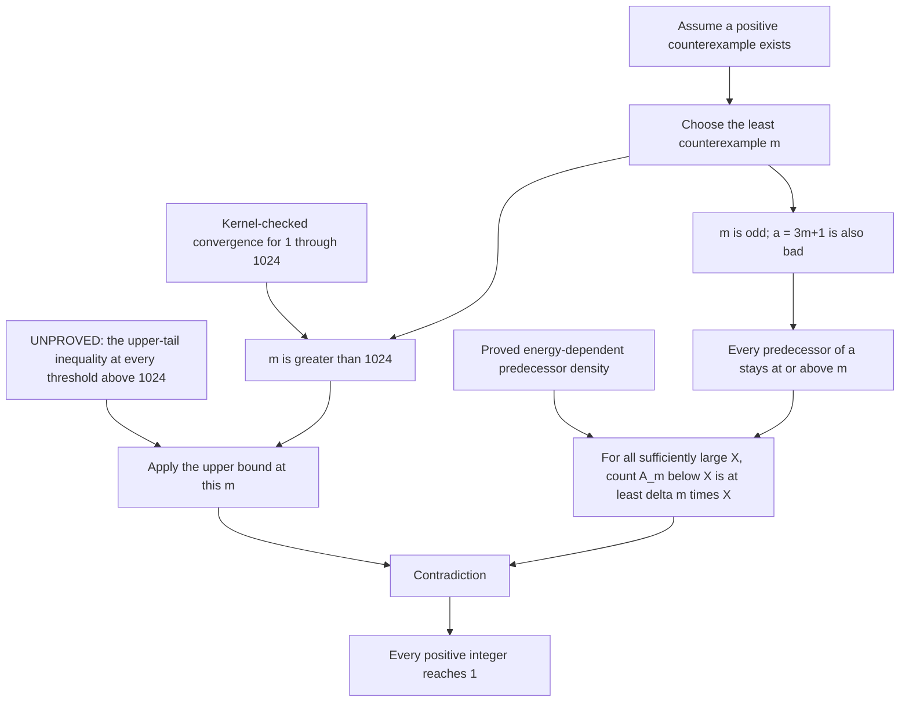

# Connecting the proved lemmas to the full conjecture

**Status: the connections are formalized; the decisive tail inequality is
unproved. This is not a proof of Collatz.** The chain below uses the actual
ordinary Collatz map and the existing unconditional predecessor theorem.
It does not assume a linear upper bound on the Syracuse energy.

The subsequent [finite-cutoff check](FiniteCutoff.md) makes the counting
cutoff explicit once an activation generation is supplied. It also verifies
an example showing that positive eventual predecessor density need not
give a predecessor below the threshold m.

Let T be the ordinary map, and define

    A_m = {n > 0 : T^[j](n) >= m for every j >= 0},
    E_r = 3^r sum_y mu_r(y)^2,
    delta(m) = d / (16 m^2 E_(4 K m)).

Here mu_r is the actual finite Syracuse probability law. The constants
K>=1 and d>0 are supplied by the previously proved energy-dependent
predecessor bound, independently of m.

## The lemma chain

1. **A least counterexample exists if any counterexample exists.**
   The positive integers are well ordered. It cannot be even: its next value
   would be smaller and would still fail to reach 1. The checked finite base
   also forces m>1024.

2. **The successor a=3m+1 is an eligible bad target.**
   It is positive and not divisible by 3. If a reached 1, m would reach 1.

3. **Every positive predecessor of a belongs to A_m.**
   A predecessor cannot reach 1 and later reach a: any forward image of a
   convergent Collatz orbit also converges. Every iterate of a bad starting
   value remains bad. By minimality of m, all those iterates are at least m.

4. **The existing density theorem now supplies a lower bound for A_m.**
   Use `energy_target_density` with A=1, target a and t=4m. Since a<=4m,
   its predecessor density is at least

       d / (a^2 E_(4 K m)) >= d / (16 m^2 E_(4 K m)) = delta(m).

   Monotonicity of counting under set inclusion carries this lower bound
   to A_m. This link is unconditional: if m were a least counterexample,
   the lower bound would follow from the proved lemmas.

5. **A sufficiently small upper tail would contradict that lower bound.**
   The exact remaining premise, `EnergyTailGap K d`, asks that for every
   fixed m>1024 and every starting cutoff X0, there exist X>=X0 with X>0 and

       count {n < X : n belongs to A_m} < delta(m) X.

   Applying this at a cutoff beyond the lower-bound threshold is the final
   contradiction. No independence assumption or exchange of limits occurs
   in this step.

## Why the existing analytic results do not fill step 5

Tao's Theorem 3.1 bounds the logarithmically weighted tail above a fixed
threshold m by O((log m)^(-c)) for some c>0. It does not make the tail zero
at a fixed threshold. See [the theorem and Remark 1.4](https://arxiv.org/pdf/1909.03562).

Logarithmic weighting differs from the natural count used here. The lower
natural-density bound can be transferred to lower logarithmic density by
summation by parts, allowing comparison in Tao's normalization. The decisive
gap remains the rate: the available upper bound does not beat the required
lower-density coefficient. Even a linear energy
upper bound, which itself remains unproved here, would only make the
coefficient of order m^(-3) by this route. Inverse powers of log m are much
larger than inverse powers of m at large thresholds. Improving E alone
therefore does not complete this comparison with the cited upper bound.

The rate mismatch is also checked in Lean. `energyProfile_le_square` proves
delta(m)<=d/(16m^2), using E_r>=1. Then
`energyProfile_eventually_lt_log_bound` proves, for every fixed integer
p>=0 and C>0, that delta(m)<C/(log m)^p for all sufficiently large m.
This compares the bounds; it does **not** assert that the actual tail is
large, or that the unproved tail-gap statement is false.

The theorem for an arbitrary function f(n) tending to infinity cannot be
used with the constant f(n)=m-1: that function does not tend to infinity.
Nor may an almost-everywhere statement be reapplied to a particular orbit
value without controlling the distribution of that value. These are
quantifier and transport gaps, not omissions Lean can solve by automation.

## Formal endpoint and its meaning

[ProofChain.lean](../ProofAtlasAttack/CollatzTargetDensity/ProofChain.lean)
proves `least_bad_forces_energy_tail`, the finite base, and the conditional
closing theorem `collatz_of_energy_tail_gap`. Its final endpoint is

    exists K>=1, exists d>0,
      EnergyTailGap K d <-> Erdos1135.collatzProp.

The right side is the canonical assertion that every positive integer has
an ordinary Collatz iterate equal to 1. The equivalence also demonstrates
the remaining premise's difficulty: for these constants, it is as strong
as Collatz. The file does not assert that the premise holds.

The follow-up [descent and threshold check](DescentVsConvergence.md) tests
two possible shortcuts. Under a least counterexample m, all thresholds
1<h<=m give exactly the full counterexample set. Also, any counterexample
would force positive lower density of counterexamples that drop immediately.
Neither lowering such thresholds nor substituting finite stopping time for
convergence supplies the missing tail inequality.

Reproduce the complete package check from `ProofAtlasAttack` with
`LEAN_NUM_THREADS=4 python3 scripts/verify.py`. The finite base uses ordinary
kernel-checked reduction, not a native evaluator. All imported analytic
lemmas retain their original pinned sources and attribution.

That stage's complete check passed on 2026-09-08 with 115 audited endpoints,
including 15 from this chain and nine from the descent follow-up.
Their transitive axiom footprints contain only
`propext`, `Classical.choice`, and `Quot.sound`. All 1,485 upstream source
hashes remained unchanged; all 39 extension source hashes were checked at
that stage. The [verification report](../ProofAtlasAttack/verification/local-report.json)
now records the latest complete package check, including subsequent modules.
The [chain audit](../ProofAtlasAttack/verification/proof-chain-axioms.log)
prints the canonical conjecture and the unproved tail-gap premise explicitly.
